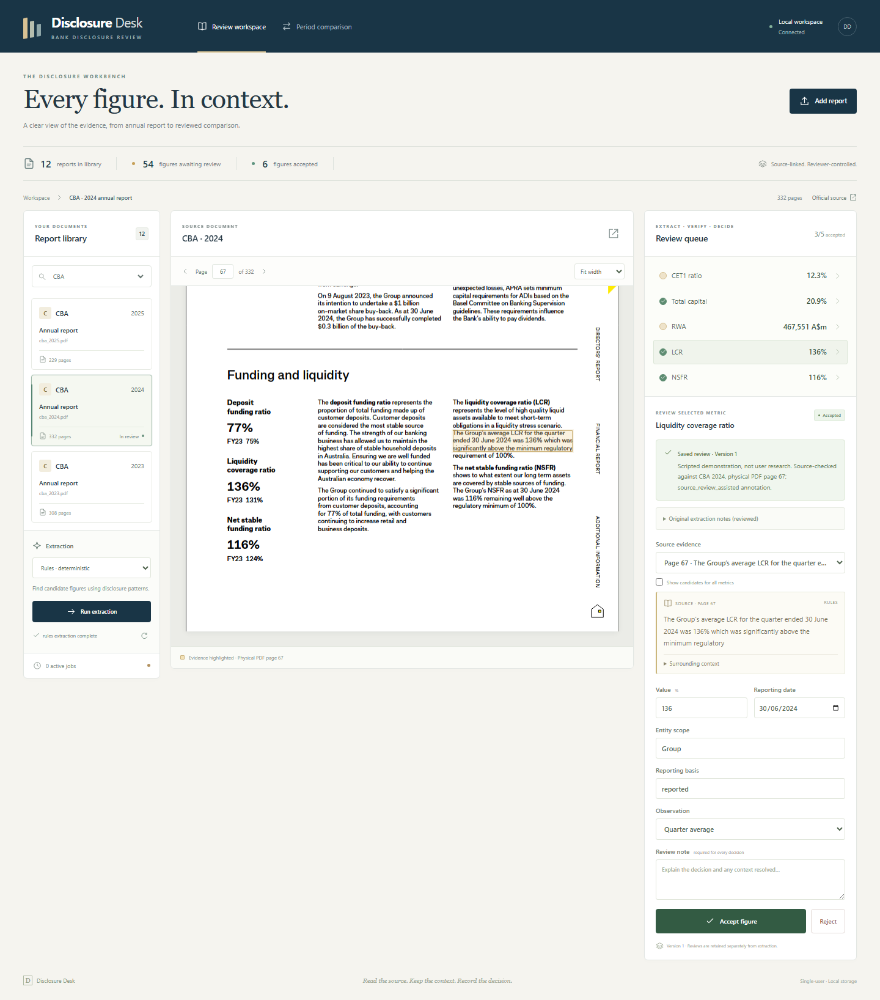
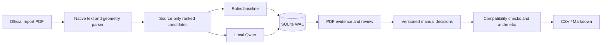

# Disclosure Desk

A local workbench for reviewing Australian bank disclosures: extract a figure, inspect its PDF evidence, confirm its reporting context, and compare two periods only after review.

**Status:** working local prototype. Real public reports; local inference; no paid APIs. This is a portfolio project, not a deployed banking system. No external user study has been conducted.

[Watch the 66-second walkthrough](docs/assets/walkthrough.webm) · [Measured results](docs/RESULTS.md) · [Comparison view](docs/assets/comparison.png)



The walkthrough uses six scripted review decisions in a separate database. It demonstrates working interactions and exports, not real user adoption or a user-study outcome.

## What you can do

- Import CBA, Westpac, ANZ and NAB annual reports and run a transparent rules baseline or local Qwen extraction.
- Review five metrics: CET1 ratio, total capital ratio, risk-weighted assets, LCR and NSFR.
- Click a proposed figure to view its physical PDF page and parser-derived evidence highlight.
- Correct the value, evidence, reporting date, entity, regulatory basis and observation type; keep an append-only review history.
- Compare only accepted, compatible observations. Ratio differences are percentage points; RWA differences are AUD millions and relative change.
- Export an evidence-linked CSV or Markdown report, including reasons that a comparison is blocked.
- Restart a separate worker after interruption without losing committed results or manual reviews.

## Quick start (Windows / Python 3.12+ / Node 22+)

```powershell
python -m venv .venv
.\.venv\Scripts\python.exe -m pip install -e ".[dev]"
pnpm --dir frontend install --frozen-lockfile
pnpm --dir frontend build
.\.venv\Scripts\python.exe scripts/fetch_corpus.py
.\.venv\Scripts\python.exe -m disclosure.cli ingest --method rules
.\scripts\start.ps1 -Python .\.venv\Scripts\python.exe
```

Open **http://127.0.0.1:8000**. The startup script runs the API and a separate worker and stops its worker when the server exits. First-time corpus processing takes longer than opening an already processed report.

Alternatively, use two terminals:

```powershell
python -m disclosure.cli serve
python -m disclosure.cli worker
```

For this development machine, the prepared Python environment is `D:/Project/.venv/Scripts/python.exe`. Report files and the local database are excluded from Git. Downloads come directly from the URLs in `data/manifest.json`, with a local SHA-256 receipt.

## Local model

Install `.[model]` and set `DISCLOSURE_MODEL_PATH` to an existing local Qwen3-4B-Instruct-2507 directory. The current workstation uses `D:/models/Qwen3-4B-Instruct-2507` and an RTX 4070 with 12 GB VRAM. Inference uses local files only, bounded context, greedy decoding and at most one retry for malformed JSON. Qwen mode requires CUDA; the rules baseline and review UI work without a GPU.

The model selects an existing evidence ID and a number from its row. Coordinates are resolved by the parser, never produced by the model. Evidence membership **does not prove** that the model chose the correct year, column or entity: every extraction starts unapproved.

## Architecture



FastAPI and the worker are separate processes. SQLite transactions protect claims and completion; expiring leases recover abandoned work, while lease tokens reject stale completion. File hashes and pipeline versions make duplicate requests idempotent. Original runs remain immutable; new reviews use optimistic version checks.

The API is documented at `/docs`. The app listens on loopback and is designed for one local reviewer. It has no cloud deployment, multi-user authentication, shared tenancy or availability guarantee.

## Evaluation

The corpus contains 12 official annual reports for 2023–2025. Development: CBA/Westpac/ANZ 2023–2024. Temporal test: those banks in 2025. Bank test: NAB 2023–2025. Only current-reporting-period targets count toward the main evaluation; comparative columns are not treated as additional independent samples.

Labels are checked against source tables with AI assistance and explicitly record their annotation status. They have **not** undergone an independent human audit. An unverified or unavailable target is excluded from the scored denominator and its absence is reported. The fixed manifest and labels both carry source SHA-256 hashes; changed PDFs fail validation rather than silently receiving stale labels.

```powershell
python -m disclosure.cli benchmark --method rules
python -m disclosure.cli benchmark --method qwen --model-path D:/models/Qwen3-4B-Instruct-2507
```

Results in `reports/` separate correct numeric values from complete correct tuples (value, unit, date, entity, basis, observation and evidence). Wrong nonempty drafts, omissions and candidate retrieval coverage are visible. Fresh-run timing includes parsing and initial model loading; recorded reports are evidence of those executions, not a live model service.

The strict tuple score also checks restatement and a labelled source page. It may undercount valid alternative citations and cannot independently prove column semantics. Numerical tolerance is fixed by each source's disclosed precision. To audit recorded predictions after a scorer correction, run `python -m disclosure.cli rescore reports/qwen.json`; this preserves original model outputs and timings and stamps the new scoring time.

Tests:

```powershell
python -m pytest -q
python -m ruff check src tests scripts
pnpm --dir frontend typecheck
pnpm --dir frontend build
```

## Deliberate limits

- Native-text English PDFs only. Scanned pages need manual processing; no OCR or vision model is included.
- Row parsing can lose complex table structure. Current-column selection and implicit footnotes remain difficult; a plausible number is never silently approved.
- Regulatory framework changes, entity changes and restatements can prevent valid comparisons. The workbench does not restate historical accounts or determine regulatory compliance.
- The 12-report pilot is small and clustered by bank. Counts do not demonstrate population-level generalisation.
- Public source links and small numeric evidence excerpts are included; original PDFs remain with their publishers and are downloaded locally.
- No claimed analyst time saving, cloud uptime or production adoption without measurement. `docs/USER_STUDY.md` provides a protocol for a future user study.

## Why this project

The accompanying portfolio already covers models, RAG, agents, evaluation and MLOps components. This workbench concentrates on their product boundary: external document variability, explicit financial semantics, recoverable processing, source review and reproducible evidence. See `docs/RESULTS.md` for measured outcomes and limitations.
